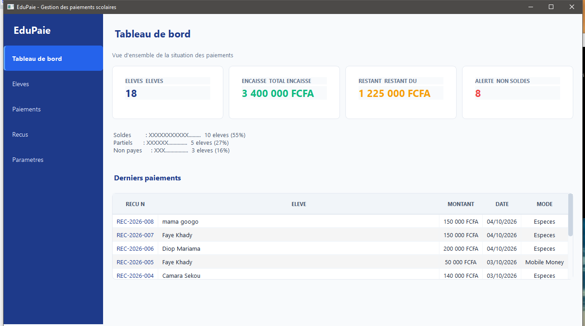
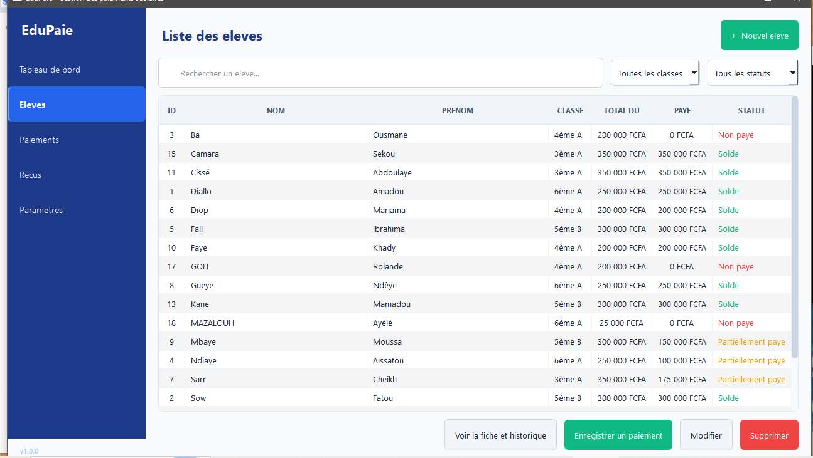
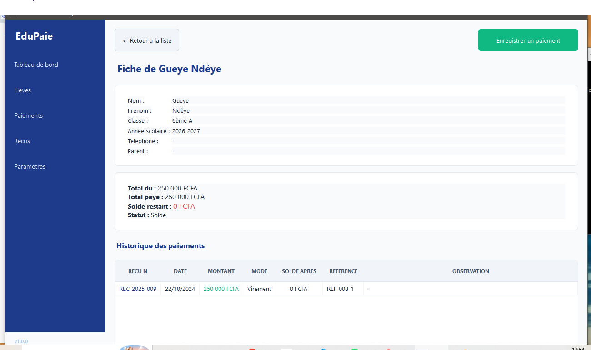
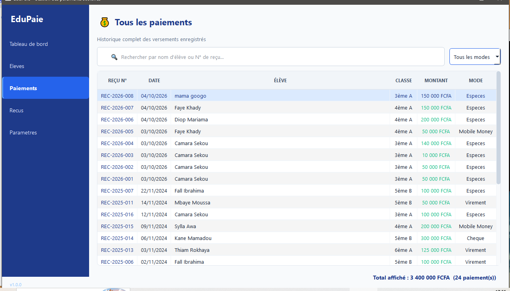
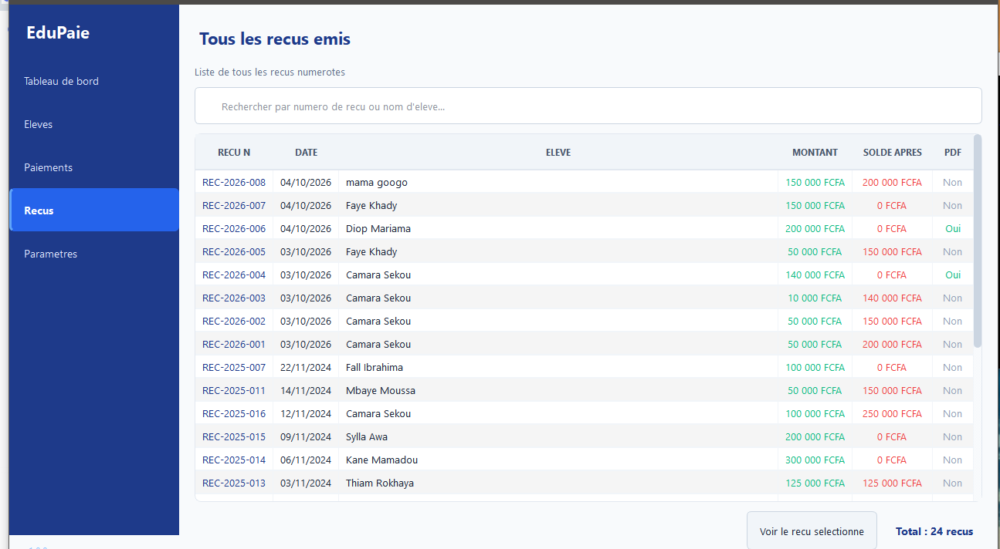
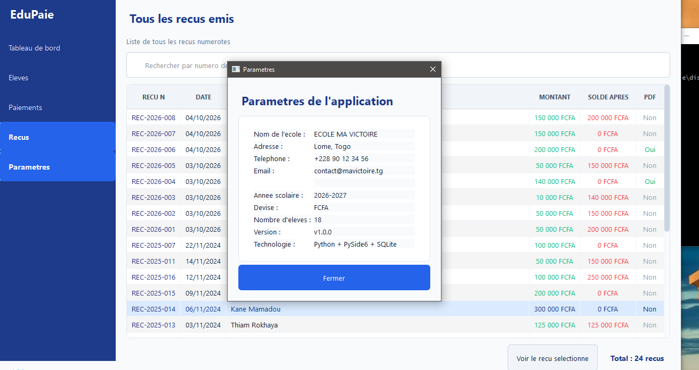
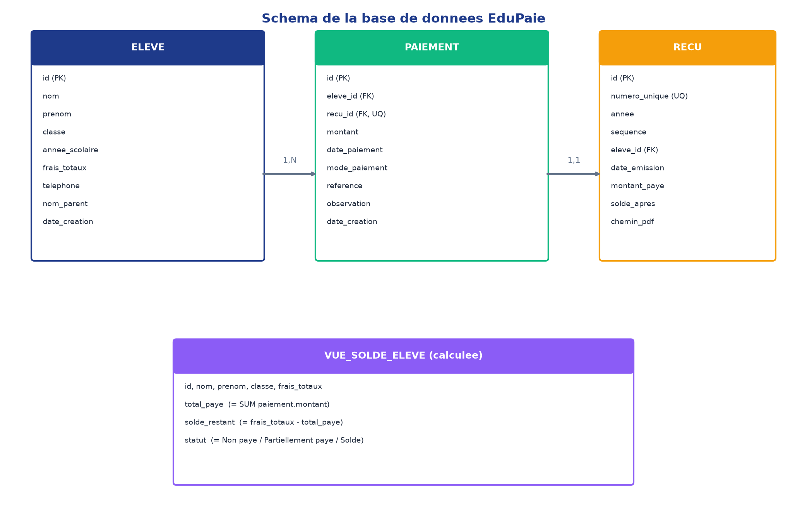

# Documentation technique - EduPaie

## 1. Vue d'ensemble

EduPaie est une application desktop de gestion des paiements scolaires.
Elle remplace la tenue manuelle (cahier, Excel) par une application
informatisee avec base de donnees, calcul automatique et recus PDF.

Stack technique :
- Python 3.10+
- PySide6 (interface graphique)
- SQLite (base de donnees, module sqlite3 standard)
- reportlab (generation PDF)
- PyInstaller (packaging .exe)

## 2. Architecture en couches

L'application suit une architecture en 3 couches :

### Couche 1 : Acces aux donnees (src/repositories/)

Chaque entite a son repository qui encapsule tout le SQL :
- EleveRepository : CRUD eleves + statistiques
- PaiementRepository : CRUD paiements + jointures
- RecuRepository : CRUD recus + numerotation

Regle : aucun autre fichier n'execute de SQL.

### Couche 2 : Logique metier (src/services/)

- EleveService : validation, regles metier
- PaiementService : enregistrement transactionnel (recu + paiement)
- RecuService : numerotation unique (REC-AAAA-NNN)
- PDFService : generation des recus PDF

Transactions : l'enregistrement d'un paiement est atomique
(soit tout reussit, soit tout est annule).

### Couche 3 : Interface (src/ui/)

- main_window.py : fenetre principale + navigation
- widgets/ : ecrans (dashboard, eleves, fiche, paiements)
- dialogs/ : dialogues modaux (eleve, paiement, recu)

Communication : les widgets communiquent par signaux PySide6.

## 3. Modele de donnees

### Table eleve

- id : INTEGER PRIMARY KEY
- nom : TEXT NOT NULL
- prenom : TEXT NOT NULL
- classe : TEXT NOT NULL
- annee_scolaire : TEXT NOT NULL
- frais_totaux : REAL CHECK >= 0
- telephone : TEXT
- nom_parent : TEXT

### Table recu

- id : INTEGER PRIMARY KEY
- numero_unique : TEXT UNIQUE
- annee : INTEGER NOT NULL
- sequence : INTEGER NOT NULL
- eleve_id : INTEGER FK eleve
- montant_paye : REAL CHECK > 0
- solde_apres : REAL CHECK >= 0
- chemin_pdf : TEXT

Contrainte : UNIQUE(annee, sequence) garantit l'unicite des numeros.

### Table paiement

- id : INTEGER PRIMARY KEY
- eleve_id : INTEGER FK eleve
- recu_id : INTEGER UNIQUE FK recu
- montant : REAL CHECK > 0
- date_paiement : TEXT NOT NULL
- mode_paiement : TEXT CHECK IN (...)
- reference : TEXT

### Vue vue_solde_eleve

Calcule dynamiquement pour chaque eleve :
- total_paye
- solde_restant
- statut (Solde / Partiellement paye / Non paye)

## 4. Regles metier

### Calcul du solde

    solde = frais_totaux - somme(paiements)

Le solde ne peut jamais etre negatif.

### Numerotation des recus

Format : REC-{ANNEE}-{SEQUENCE:03d}
Exemple : REC-2025-001, REC-2025-002, ...

La sequence est par annee. Chaque nouvelle annee repart a 001.

### Statuts

- total_paye = 0 : Non paye
- total_paye >= frais : Solde
- 0 < total_paye < frais : Partiellement paye

## 5. Choix techniques

### Pourquoi SQLite ?

- Aucune installation de serveur
- Fichier unique portable
- Parfait pour application desktop mono-poste
- Module sqlite3 inclus dans Python

### Pourquoi PySide6 ?

- Framework Qt moderne
- Signaux/slots clairs
- Look natif
- Licence LGPL

### Pourquoi reportlab ?

- Generation PDF professionnelle
- Controle total de la mise en page
- Licence BSD

### Pourquoi une architecture en couches ?

- Testabilite : tester la logique sans interface
- Maintenabilite : changer l'UI ne touche pas au metier
- Evolutivite : migration PostgreSQL possible

## 6. Limites connues

- Application mono-poste (pas de synchro reseau)
- Pas de gestion multi-utilisateurs
- Pas d'export Excel / CSV
- Montant en lettres non implemente

## 7. Ameliorations possibles

- Authentification utilisateurs
- Synchronisation cloud
- Envoi recus par email / SMS
- Tableau de bord avec graphiques
- Sauvegarde automatique

---

## 8. Captures d'ecran

### 8.1 Tableau de bord

Vue d'ensemble : nombre d'eleves, total encaisse, restant du, eleves non soldes,
repartition par statut et derniers paiements.

### 8.2 Liste des eleves

Liste complete avec recherche instantanee, filtres par classe et statut,
et colonne "Reste a payer" coloree.

### 8.3 Fiche eleve

Informations personnelles, situation financiere (du / paye / solde restant)
et historique complet des paiements.

### 8.4 Enregistrement d'un paiement

Dialogue avec calcul en temps reel du nouveau solde et validation du montant.

### 8.5 Liste des recus

Liste complete des recus numerotes avec acces direct au PDF.

### 8.6 Parametres

Configuration centralisee (nom ecole, adresse, annee scolaire, devise).

---

## 9. Modele de donnees

Voir le document dedie : [MCD/MLD](MCD_MLD.md)

---

## 10. Guide d'installation

Voir le document dedie : [Guide d'installation](installation.md)

---

## 11. Guide de soutenance

Voir le document dedie : [Guide de soutenance](guide_soutenance.md)

---

**Fin de la documentation technique - EduPaie v1.0.0**
